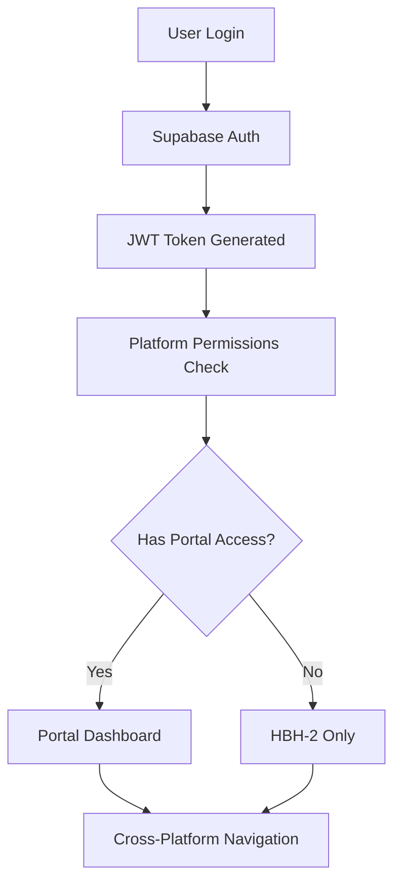

# HBH-2 & HBH Portal System Architecture

## Overview

This document defines the system architecture and integration points between the two platforms:
- **HBH-2**: Main real estate platform (currently active)
- **HBH Portal**: Internal company growth and collaboration platform

## Current Infrastructure Analysis

### Existing Tech Stack
- **Frontend**: Next.js 14+ with React 18.3.1
- **Backend**: Next.js API routes with Prisma ORM
- **Database**: PostgreSQL via Supabase
- **Authentication**: Supabase Auth with custom user roles
- **Real-time**: Pusher for live updates
- **Payments**: Stripe integration
- **File Storage**: Cloudinary
- **Monitoring**: Sentry

### Current Supabase Projects
- **v0HBH2** (ID: mqmfzpkvuucvvbqlnzci) - Active, us-east-1
- **HBHPortal** (ID: odliadyhikcupiyjfudj) - Inactive, us-east-1

## Platform Definitions

### 1. HBH-2 (Main Platform)
**Core Functionality:**
- Property listing and bidding system
- Auction functionality with real-time bidding
- Transaction tracking (offer → title → inspection → closing)
- Communication with service providers
- Document upload and deal progress logs
- User management with roles: Sellers, Buyers, Wholesalers, Title Agents

**Current User Roles:**
```typescript
enum UserRole {
  USER,           // Basic users (buyers/sellers)
  PROFESSIONAL,   // Service providers
  ADMIN          // System administrators
}
```

### 2. HBH Portal (Companion Platform)
**Core Functionality:**
- Learning Center: courses and resources for onboarding
- Real Estate Team Management by location
- Investment Group Creation and management
- KPI Tracking System with dashboards
- Employee Hub for internal communication

**New User Roles (to be added):**
```typescript
enum PortalRole {
  EMPLOYEE,       // Company employees
  TEAM_LEAD,      // Team leaders
  MANAGER,        // Regional managers
  EXECUTIVE,      // C-level executives
  INVESTOR,       // Investment group members
  TRAINER         // Learning center instructors
}
```

## Integration Architecture

### 1. Shared Authentication System

#### Current Implementation
- Supabase Auth with JWT tokens
- Custom user roles stored in Prisma database
- Session management via cookies

#### Integration Strategy
```typescript
// Enhanced user model for cross-platform support
model User {
  // Existing fields...
  
  // Platform access
  hbh2Access      Boolean @default(true)
  portalAccess    Boolean @default(false)
  
  // Portal-specific fields
  employeeId      String?
  department      String?
  hireDate        DateTime?
  teamId          String?
  team            Team? @relation(fields: [teamId], references: [id])
  
  // Investment groups
  investmentGroups InvestmentGroupMember[]
  
  // Learning progress
  courseProgress   CourseProgress[]
  certifications   Certification[]
}
```

#### Single Sign-On (SSO) Flow
1. User authenticates via Supabase Auth
2. JWT token contains platform permissions
3. Cross-platform navigation maintains session
4. Role-based access control enforced on both platforms

### 2. Database Architecture

#### Option A: Shared Database (Recommended)
- Single Supabase project for both platforms
- Unified user management
- Shared data models where applicable
- Platform-specific tables with clear naming conventions

#### Option B: Federated Databases
- Separate Supabase projects
- Cross-platform data sync via APIs
- More complex but better isolation

**Recommended: Option A with shared database**

### 3. New Data Models for Portal

```typescript
// Team Management
model Team {
  id          String @id @default(cuid())
  name        String
  location    String // City, State, Region
  type        TeamType
  leaderId    String
  leader      User @relation("TeamLeader", fields: [leaderId], references: [id])
  members     User[]
  projects    Project[]
  kpis        TeamKPI[]
  createdAt   DateTime @default(now())
}

enum TeamType {
  SALES,
  OPERATIONS,
  MARKETING,
  DEVELOPMENT
}

// Investment Groups
model InvestmentGroup {
  id              String @id @default(cuid())
  name            String
  description     String?
  targetAmount    Float
  currentAmount   Float @default(0)
  status          InvestmentStatus @default(ACTIVE)
  createdById     String
  createdBy       User @relation(fields: [createdById], references: [id])
  members         InvestmentGroupMember[]
  properties      InvestmentProperty[]
  createdAt       DateTime @default(now())
}

model InvestmentGroupMember {
  id              String @id @default(cuid())
  groupId         String
  group           InvestmentGroup @relation(fields: [groupId], references: [id])
  userId          String
  user            User @relation(fields: [userId], references: [id])
  contribution    Float
  role            InvestmentRole @default(MEMBER)
  joinedAt        DateTime @default(now())
}

// Learning Center
model Course {
  id              String @id @default(cuid())
  title           String
  description     String
  category        CourseCategory
  duration        Int // minutes
  difficulty      CourseDifficulty
  instructorId    String
  instructor      User @relation(fields: [instructorId], references: [id])
  modules         CourseModule[]
  enrollments     CourseProgress[]
  isRequired      Boolean @default(false)
  createdAt       DateTime @default(now())
}

model CourseProgress {
  id              String @id @default(cuid())
  userId          String
  user            User @relation(fields: [userId], references: [id])
  courseId        String
  course          Course @relation(fields: [courseId], references: [id])
  progress        Int @default(0) // 0-100
  completedAt     DateTime?
  startedAt       DateTime @default(now())
}

// KPI Tracking
model KPI {
  id              String @id @default(cuid())
  name            String
  description     String?
  category        KPICategory
  targetValue     Float
  currentValue    Float @default(0)
  unit            String // e.g., "deals", "dollars", "percentage"
  period          KPIPeriod
  ownerId         String? // User, Team, or Company level
  owner           User? @relation(fields: [ownerId], references: [id])
  teamId          String?
  team            Team? @relation(fields: [teamId], references: [id])
  history         KPIHistory[]
  createdAt       DateTime @default(now())
}

model KPIHistory {
  id              String @id @default(cuid())
  kpiId           String
  kpi             KPI @relation(fields: [kpiId], references: [id])
  value           Float
  recordedAt      DateTime @default(now())
  notes           String?
}
```

## Integration Points

### 1. User Synchronization
```typescript
// Service for cross-platform user sync
class UserSyncService {
  async syncUserBetweenPlatforms(userId: string) {
    // Update user permissions
    // Sync profile data
    // Update team assignments
    // Refresh investment group memberships
  }
  
  async grantPortalAccess(userId: string, role: PortalRole) {
    // Enable portal access
    // Assign appropriate role
    // Trigger onboarding flow
  }
}
```

### 2. Investment Group Integration
```typescript
// When investment group invests in HBH-2 property
class InvestmentIntegrationService {
  async linkPropertyToInvestmentGroup(
    propertyId: string, 
    groupId: string, 
    investmentAmount: float
  ) {
    // Create investment record
    // Update property ownership structure
    // Sync with HBH-2 transaction system
  }
}
```

### 3. Learning Progress Integration
```typescript
// Unlock HBH-2 features based on completed courses
class LearningIntegrationService {
  async updateUserPermissions(userId: string, completedCourseId: string) {
    const course = await getCourse(completedCourseId)
    
    if (course.category === 'ADVANCED_BIDDING') {
      // Unlock advanced auction features
      await updateUserRole(userId, { canAccessAdvancedBidding: true })
    }
  }
}
```

### 4. KPI Data Integration
```typescript
// Sync HBH-2 transaction data to Portal KPIs
class KPIIntegrationService {
  async syncTransactionKPIs() {
    // Pull completed transactions from HBH-2
    // Update individual and team KPIs
    // Calculate commission and performance metrics
  }
  
  async syncPropertyKPIs() {
    // Pull property listing data
    // Update listing performance metrics
    // Track conversion rates
  }
}
```

## Security Architecture

### 1. Authentication Flow


### 2. Role-Based Access Control (RBAC)
```typescript
// Enhanced permissions system
interface PlatformPermissions {
  // HBH-2 permissions (existing)
  hbh2: UserPermissions

  // Portal permissions (new)
  portal: {
    canAccessLearningCenter: boolean
    canManageTeam: boolean
    canCreateInvestmentGroups: boolean
    canViewCompanyKPIs: boolean
    canManageEmployees: boolean
    canAccessReports: boolean
  }
}
```

### 3. Data Security
- Row Level Security (RLS) policies in Supabase
- API rate limiting
- Input validation and sanitization
- Audit logging for sensitive operations

## API Architecture

### 1. Shared API Services
```typescript
// Cross-platform API structure
/api/
  shared/
    auth/
    users/
    notifications/
  hbh2/
    properties/
    auctions/
    transactions/
  portal/
    teams/
    learning/
    investments/
    kpis/
```

### 2. Real-time Integration
```typescript
// Pusher channels for cross-platform updates
const channels = {
  // HBH-2 channels (existing)
  'auction-updates': 'auction-{propertyId}',
  'transaction-updates': 'transaction-{transactionId}',

  // Portal channels (new)
  'team-updates': 'team-{teamId}',
  'investment-updates': 'investment-{groupId}',
  'kpi-updates': 'kpi-{userId|teamId}',
  'learning-progress': 'user-{userId}-learning'
}
```

## Deployment Strategy

### Phase 1: Foundation (Weeks 1-2)
1. Activate HBH Portal Supabase project
2. Implement shared authentication
3. Create basic Portal UI structure
4. Set up cross-platform navigation

### Phase 2: Core Features (Weeks 3-6)
1. Implement Learning Center
2. Build Team Management system
3. Create Investment Group functionality
4. Develop KPI tracking system

### Phase 3: Integration (Weeks 7-8)
1. Implement cross-platform data sync
2. Build integration APIs
3. Create unified dashboards
4. Implement real-time updates

### Phase 4: Testing & Launch (Weeks 9-10)
1. Comprehensive testing
2. Security audit
3. Performance optimization
4. Production deployment

## Monitoring and Analytics

### 1. Application Monitoring
- Sentry for error tracking (both platforms)
- Performance monitoring
- User behavior analytics

### 2. Business Intelligence
- KPI dashboards
- Cross-platform user journey tracking
- Investment performance analytics
- Learning effectiveness metrics

## Scalability Considerations

### 1. Database Scaling
- Read replicas for reporting
- Connection pooling
- Query optimization

### 2. Application Scaling
- Horizontal scaling with load balancers
- CDN for static assets
- Caching strategies (Redis)

### 3. Real-time Scaling
- Pusher cluster configuration
- WebSocket connection management
- Event queue processing
